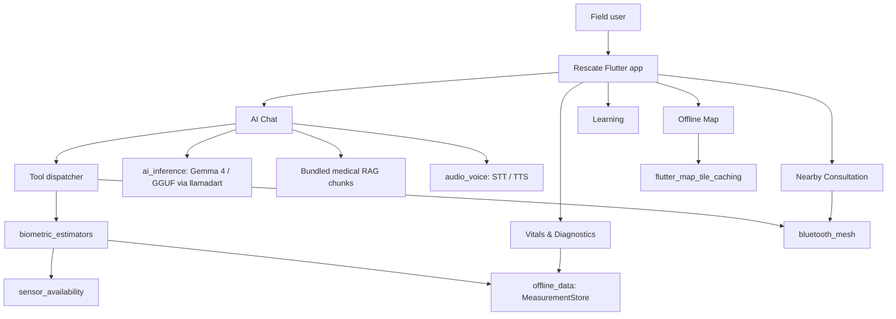

# Rescate


Rescate is an offline-first emergency medical assistant for people operating in
field conditions where the internet, professional care, power, storage, and
trustworthy infrastructure may all be limited.

It combines on-device Gemma 4 reasoning, retrieval over curated emergency
medicine references, local speech input/output, sensor-derived vitals,
offline maps, and short-range peer-to-peer communication into a single Flutter
workspace.

**Competition submission:** Rescate was submitted to
[The Gemma 4 Good Hackathon](https://www.kaggle.com/competitions/gemma-4-good-hackathon)
on Kaggle.

## Why Gemma 4

Gemma 4 made Rescate possible in a way no other model could. Its architecture
is optimized for efficient inference on constrained hardware, delivering
coherent, medically grounded reasoning at a fraction of the memory footprint of
comparable models. In field conditions where phones run hot, batteries deplete
quickly, and storage is limited, that efficiency is not a technical preference;
it is a survival requirement.

Critically, Gemma 4's open weights allowed Rescate to be tuned around curated
emergency medical material and deployed fully on-device, without data egress,
licensing lock-in, or dependence on external infrastructure. For a humanitarian
application built on the principle that access to help should never require
internet access, Gemma 4 is the enabling choice.


## Product Snapshot

| Area | What Rescate provides |
| --- | --- |
| AI assistant | Local GGUF model loading, streaming responses, thought/answer channel parsing, tool calls, Arabic and English prompts, persistent chat history. |
| Medical RAG | Offline retrieval from bundled emergency medicine chunks and PDF-derived corpora before prompting the model. |
| Voice | Speech-to-text and text-to-speech wrappers with Arabic/English locale selection and automatic read-aloud support. |
| Vitals | Sensor availability probing, biometric test catalog, local measurement storage, recent-vitals context injection into AI chat. |
| Maps | Offline map tile caching, location tracking, heading/compass mode, danger and aid reports, safe-route calculation around danger zones. |
| Community | Nearby Connections based Bluetooth/Wi-Fi discovery, chat, and vitals sharing for doctor or responder consultation. |
| Learning | Searchable first-aid lessons, CPR guidance, and animated CPR frames bundled as app assets. |
| Privacy | On-device inference and local storage by design; no cloud API is required for core operation. |

## Screens

| AI chat | Nearby consultation | Offline map |
| --- | --- | --- |
|  |  |  |

| Learning | Vitals |
| --- | --- |
|  |  |

## Repository Layout

```text
Rescate/
  apps/
    rescate_app/              Main Flutter application
  packages/
    ai_inference/             Local Gemma/GGUF inference, RAG prompt building, tool calling
    audio_voice/              STT and TTS services
    biometric_estimators/     Signal processing and biometric capture estimators
    bluetooth_mesh/           Nearby Connections peer-to-peer messaging
    dev_profiler/             Debug-only profiling and JSON export
    offline_data/             SQLite measurement store and vector store primitives
    security_crypto/          Security and cryptography boundary package
    sensor_availability/      Android/iOS hardware sensor existence detection
  rag_system/                 Python RAG preparation scripts, PDFs, Piper assets, TTS outputs
  assets/                     README and submission visuals
  test/                       Workspace smoke test
```

This is a Dart workspace. The root `pubspec.yaml` wires the Flutter app and all
local packages together.

## Architecture

Rescate follows a package-based monorepo architecture. The Flutter UI remains
feature-based under `apps/rescate_app/lib/features`, while lower-level domains
live in isolated packages.



## Core Features

### 1. On-device medical AI

The AI chat screen loads a local `.gguf` model from device storage and streams
responses through `LlmService`. The loader uses a hardware-aware fallback ladder:

- Vulkan all-layer offload when the device can support it.
- Safer Vulkan configurations with smaller context and KV cache.
- CPU-only safe mode for devices with unstable GPU drivers.
- Sticky diagnostics to avoid crash loops after native model-load failures.
- Optional GPU disabling on known budget MediaTek/Mali profiles.

The app does not copy model files into app storage. Users browse to a `.gguf`
file and Rescate reads it in place.

### 2. Medical RAG

Rescate bundles `assets/chunks.json`, produced from emergency medical PDFs and
guidelines. `LegacyRag` expands English and Arabic search terms, retrieves the
most relevant chunks, and builds the final Gemma chat prompt.

The top-level `rag_system/` folder also contains Python scripts for rebuilding
the corpus:

```bash
python rag_system/step1_parse_and_chunk.py
python rag_system/step2_build_index.py
```

Reference material in the repository includes first aid, field emergency care,
burn classification, chronic diseases, fractures, poisoning, neurological
emergencies, mental health and shock, breathing and chest injuries, and related
survival medicine documents.

### 3. Tool calling

The app declares three model-facing tools:

- `get_biometric`: asks for consent, captures a vital through phone sensors,
  stores the measurement, and returns value/unit/confidence to the model.
- `request_help_nearby`: broadcasts a compact help request to connected nearby
  peers over the local mesh.
- `show_cpr_tutorial`: surfaces an inline button that opens the CPR lesson.

Tool execution lives in the app layer because it needs UI, navigation, consent
dialogs, and access to the app's measurement store.

### 4. Sensor and biometric pipeline

`sensor_availability` detects 26 hardware sensors on Android and iOS, grouped
across motion, environment, proximity/depth, radio, system, biometric, vitals,
and audio/visual categories.

`biometric_estimators` maps available sensors to a biometric catalog that
includes:

- PPG cardiovascular heart-rate estimation
- Seismocardiography and gyrocardiography
- Acoustic respiration
- Spirometry
- Pupillometry
- Flicker dosimetry
- Grip strength
- Proximity-based respiration
- Stubs for hardware-dependent measurements such as pulse oximetry, core body
  temperature, wound morphometry, radar cardiopulmonary capture, and others

Measurements are saved locally through `offline_data` in SQLite and can be
attached to AI messages or shared in nearby chat.

### 5. Offline maps and safety routing

The map tab uses `flutter_map`, OpenStreetMap tiles, and
`flutter_map_tile_caching`. It can:

- Request current location and track updates.
- Cache map regions around the user for offline use.
- Display heading/orientation using accelerometer and magnetometer streams.
- Let users mark danger zones and aid points.
- Route around danger zones through `OfflineRouteService`.
- Persist reports and downloaded-area metadata in local preferences.

### 6. Nearby consultation

The community tab wraps Google Nearby Connections through the `bluetooth_mesh`
package. It can advertise, discover, connect, chat, and share recent vitals
without relying on internet connectivity. Demo mode can simulate nearby doctors
and responses for presentation scenarios.

### 7. Learning module

The learning tab provides searchable first-aid lessons such as CPR basics,
wound care, fractures and splints, burns, food poisoning, and choking response.
CPR lesson frames are stored in:

```text
apps/rescate_app/assets/learn/cpr/
```

### 8. Voice interface

`audio_voice` wraps native speech-to-text and text-to-speech services. It
supports English and Arabic locale selection, automatic read-aloud for AI
responses, markdown/system-context cleanup before speech, and live dictation
into the chat input.

## Packages

| Package | Purpose |
| --- | --- |
| `ai_inference` | GGUF model lifecycle, Gemma prompt template, RAG prompt assembly, streamed generation, tool-call parsing, load diagnostics. |
| `audio_voice` | Native STT/TTS services with English and Arabic support. |
| `biometric_estimators` | Sensor acquisition, DSP utilities, capture sessions, biometric estimator registry, measurement models. |
| `bluetooth_mesh` | Nearby Connections discovery, advertising, connection state, byte payload messaging. |
| `dev_profiler` | Debug-only span/event/counter profiling and JSON export. |
| `offline_data` | SQLite measurement persistence and vector-store primitives for semantic search experiments. |
| `security_crypto` | Security package boundary for Ed25519, Curve25519, SQLCipher-related work. |
| `sensor_availability` | Native Android/iOS plugin for sensor existence checks and biometric availability resolution. |

## Getting Started

### Prerequisites

- Flutter 3.19 or newer
- Dart SDK compatible with `^3.11.4`
- Android Studio / Android SDK for Android builds
- Xcode for iOS builds
- CMake/NDK as needed by native model and audio dependencies

### Install dependencies

From the repository root:

```bash
flutter pub get
```

### Run the app

```bash
cd apps/rescate_app
flutter run
```

For Android builds with the intended Vulkan offload path, pass the relevant
llamadart defines:

```bash
flutter run \
  --dart-define=LLAMADART_ANDROID_VULKAN_ALLOW_OP_OFFLOAD=true \
  --dart-define=LLAMADART_ANDROID_VULKAN_ALLOW_KQV=true \
  --dart-define=LLAMADART_ANDROID_VULKAN_ALLOW_FLASH_ATTN=true
```

On Windows PowerShell, use backticks instead of backslashes for line
continuation, or put the command on one line.

### Load a model

1. Put a Gemma-compatible instruction-tuned `.gguf` file on the device.
2. Open Rescate.
3. Go to AI Chat.
4. Tap model setup.
5. Browse to the `.gguf` file.
6. Load normally, or enable Safe mode to force CPU-only loading.

The app remembers the selected path and attempts to auto-load it on subsequent
launches unless previous diagnostics show that the model exhausted all fallback
configurations.

## Testing

Run the whole workspace test suite:

```bash
flutter test
```

Run static analysis:

```bash
flutter analyze
```

Run package-specific tests as needed:

```bash
flutter test packages/sensor_availability
flutter test packages/biometric_estimators
flutter test packages/ai_inference
flutter test packages/offline_data
```

## Data, Privacy, and Safety

Rescate is designed for offline operation. Core features run locally: model
inference, retrieval, chat history, measurement storage, map reports, and nearby
peer communication. The map tile downloader uses network access only when the
user downloads offline map regions.

This project is emergency decision-support software, not a certified medical
device. Its role is to help structure action under constrained conditions, keep
reference material accessible offline, and make local device capabilities useful
when no professional infrastructure is reachable.

## Current Limitations

- The repository contains demo paths and presentation UI in addition to
  production-oriented modules.
- Some biometric estimators are stubs until the required hardware is available.
- Nearby mesh security has a TODO for ephemeral Ed25519 identity wiring.
- The RAG corpus is bundled as chunks; rebuilding or replacing it requires
  running the Python preparation scripts.
- `ffmpeg` is not required for the current assets; the README uses the provided
  image files as-is.

## Contributing

Read [CONTRIBUTING.md](CONTRIBUTING.md) before making changes. The main rule is
to preserve package boundaries: app UI belongs under `apps/rescate_app`, while
AI inference, data, voice, mesh, sensors, biometrics, crypto, and profiling stay
inside their respective packages.

## License

This repository includes an Apache 2.0 license. See [LICENSE](LICENSE).
