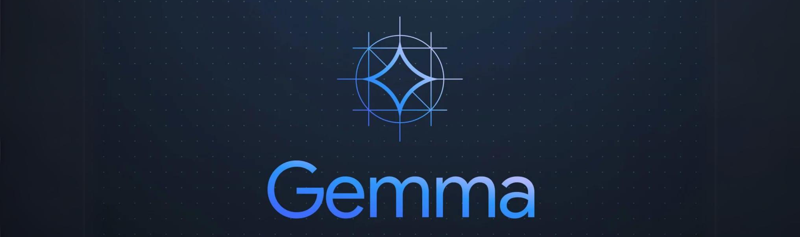

<p align="center">
  
</p>

<h1 align="center">Rescate</h1>

<p align="center">
  <strong>Offline-first emergency response, built for the moments when networks fail.</strong>
</p>

<p align="center">
  
  
  
  
</p>

<p align="center">
  <a href="#experience">Experience</a>
  |
  <a href="#system">System</a>
  |
  <a href="#workspace">Workspace</a>
  |
  <a href="#run">Run</a>
</p>

<br>

<!--
  Future brand slots:
  The README currently uses the shipped assets/ visuals.
  If the brand package changes, replace these with final exports:
  - docs/brand/hero.png
  - docs/brand/screens-ai-map-vitals.png
  - docs/brand/workspace-system.png
-->

<p align="center">
  
</p>

<table>
  <tr>
    <td width="33%" align="center">
      
      <br>
      <strong>On-device guidance</strong>
    </td>
    <td width="33%" align="center">
      
      <br>
      <strong>Offline coordination</strong>
    </td>
    <td width="33%" align="center">
      
      <br>
      <strong>Rapid assessment</strong>
    </td>
  </tr>
</table>

<br>

<table>
  <tr>
    <td width="50%" align="center">
      
      <br>
      <strong>First-aid learning</strong>
    </td>
    <td width="50%" align="center">
      
      <br>
      <strong>Nearby consultation</strong>
    </td>
  </tr>
</table>

## Experience

<table>
  <tr>
    <td width="20%" align="center"><strong>Learn</strong></td>
    <td width="20%" align="center"><strong>Map</strong></td>
    <td width="20%" align="center"><strong>AI Chat</strong></td>
    <td width="20%" align="center"><strong>Consult</strong></td>
    <td width="20%" align="center"><strong>Vitals</strong></td>
  </tr>
  <tr>
    <td align="center">CPR and first-aid flows</td>
    <td align="center">MBTiles, routing, danger and aid markers</td>
    <td align="center">GGUF model loading, streaming local LLM</td>
    <td align="center">Nearby responder mesh and shared vitals</td>
    <td align="center">Sensor-backed measurement workflows</td>
  </tr>
</table>

<p align="center">
  
</p>

## System

<p align="center">
  
</p>

<table>
  <tr>
    <td width="25%"><strong>Local intelligence</strong><br>On-device LLM inference, voice activity detection, and Piper TTS.</td>
    <td width="25%"><strong>Offline data</strong><br>SQLite FTS5, vector search, cached media, and MBTiles.</td>
    <td width="25%"><strong>Mesh response</strong><br>Bluetooth / Wi-Fi Direct coordination with tiny packets.</td>
    <td width="25%"><strong>Secure by default</strong><br>Ephemeral Ed25519 identity, Curve25519, and encrypted storage boundaries.</td>
  </tr>
</table>

<p align="center">
  <strong>Submitted to The Gemma 4 Good Hackathon.</strong>
</p>

## Workspace

```text
Rescate
|-- apps
|   `-- rescate_app              Flutter emergency response app
`-- packages
    |-- ai_inference             llama.cpp / GGUF / streaming chat
    |-- audio_voice              offline VAD and Piper TTS
    |-- biometric_estimators     sensor-derived vital estimates
    |-- bluetooth_mesh           local responder mesh
    |-- dev_profiler             development profiling tools
    |-- offline_data             FTS5, vector store, maps, measurements
    |-- security_crypto          Ed25519, Curve25519, SQLCipher boundaries
    `-- sensor_availability      Android / iOS sensor detector plugin
```

<table>
  <tr>
    <td align="center"><strong>Flutter app</strong><br><code>apps/rescate_app</code></td>
    <td align="center"><strong>Dart workspace</strong><br><code>pubspec.yaml</code></td>
    <td align="center"><strong>Feature UI</strong><br><code>lib/features/*</code></td>
  </tr>
</table>

## Run

```bash
flutter pub get
flutter run -t apps/rescate_app/lib/main.dart
```

Platform folders can be regenerated inside the app when needed:

```bash
cd apps/rescate_app
flutter create --platforms=android,ios --org dev.rescate .
```

## Engineering Notes

<table>
  <tr>
    <td><strong>Keep domain logic in packages.</strong><br>The UI app consumes package APIs; packages do not depend on the app.</td>
    <td><strong>Keep mesh packets under 100 bytes.</strong><br>BLE and Wi-Fi Direct constraints are part of the product contract.</td>
  </tr>
  <tr>
    <td><strong>Keep native changes cold-start aware.</strong><br>Android, iOS, CMake, FFI, and plugin edits need full rebuilds.</td>
    <td><strong>Keep emergency data local first.</strong><br>Offline behavior is the baseline, not a fallback.</td>
  </tr>
</table>

<br>

<p align="center">
  <strong>Built for responders, patients, and communities operating beyond the edge of connectivity.</strong>
</p>

<p align="center">
  <a href="CONTRIBUTING.md">Contributing</a>
  |
  <a href="CLAUDE.md">Repository Guide</a>
  |
  <a href="apps/rescate_app">App</a>
</p>
